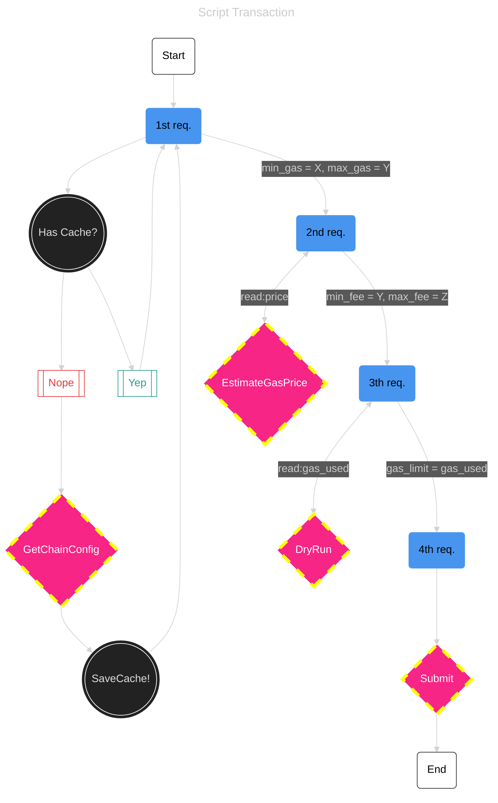
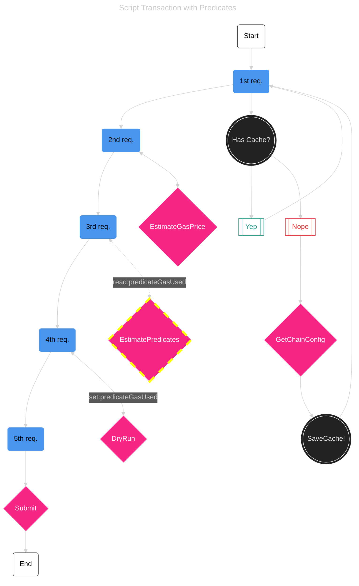
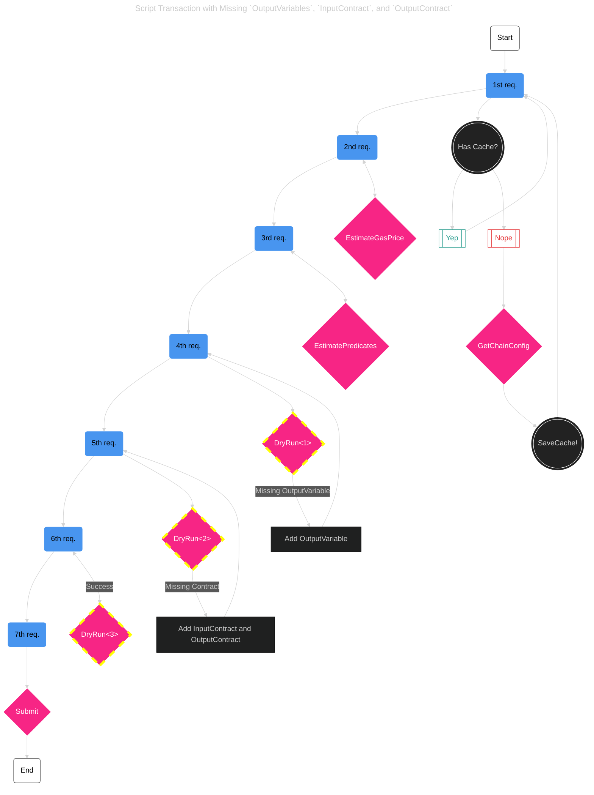
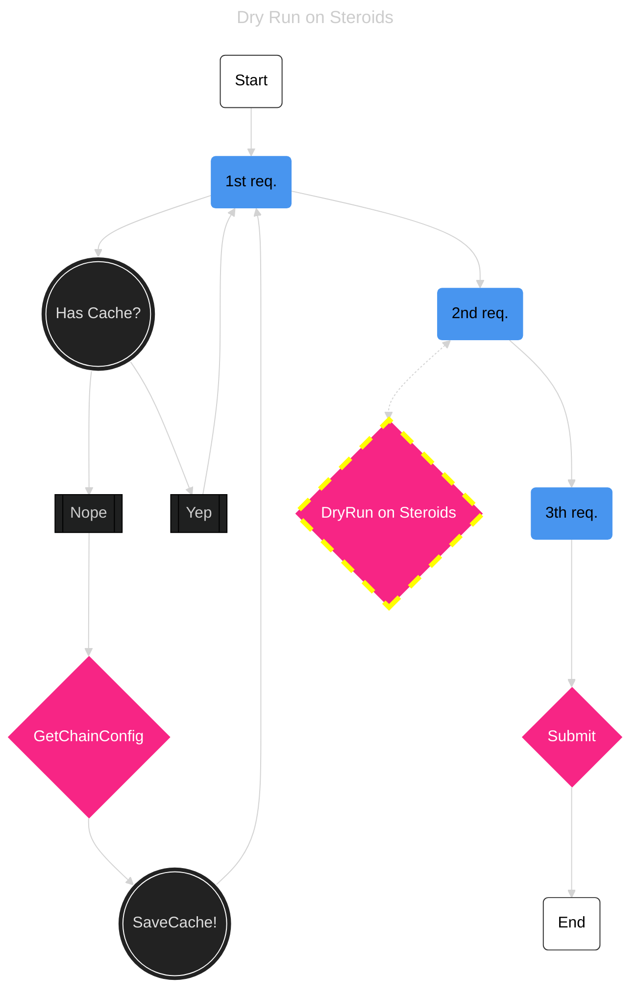

# Transaction Flow & Gas Estimation

These investigations try to illuminate some of our primary DevEx issues around transaction flow and estimation. The more requests we need to process, the more roundtrips we have, and the slower the overall perceived time for the end user using the front end of a Fuel dApp.

The situation is even worse with `Predicates` and missing `OutputVariables`—the latter exponentially increase the number of HTTP requests. Nevertheless, even our most common and straightforward transaction type requires 4x HTTP requests.

## Example Stats

Here are some stats about the number of requests each example requires:

| Transaction Type | Required HTTP Requests | Time (Wifi) | Time (4G)
|--|--|--|--|
| `ScriptTransaction` | 4+ | 2.262s | 2.622s |
| `ScriptTransaction` + `Predicate(s)` | 5+ | 2.473s | 2.816s |
| `ScriptTransaction` + 1x missing `OutputVariables` | 5+ | 2.467s | 2.989s |
| `ScriptTransaction` + 4x missing `OutputVariables` | 8+ | 3.854s | 4.193s |

## Challenges

Our main challenges can be generally reduced to:

- Dynamic Gas Pricing
  - _Requires a GraphQL query for every transaction, introducing overhead._
- Script Transactions
  - _Depends on a dry run to calculate the script gas limit, but the dry run itself requires a valid script gas limit._
- Predicates
  - _Adds complexity with an additional GraphQL query to estimate the predicate gas used._
- Missing `OutputVariable` or `InputContract` and `OutputContract`
  - _Dry run failures due to missing inputs and outputs lead to inefficient brute force retries._

 

# Transaction Introspection

## 1. Script Transactions

HTTP Requests:
1.  The first fetches chain config
    - Used for computing:
      - `min_gas`
      - `max_gas`
2.  The second fetches dynamic prices via the `estimateGasPrice` query
    - Used for computing:
      - `min_fee`
      - `max_fee`
3.  The third performs a `dryRun`
    - Set a gas limit as [the received] gas used
4.  The fourth submits the final transaction

### Chicken Egg Problem — `gasLimit`

The third step above, the dry run itself, also requires a valid script gas limit.

- If the initial gas limit is set too low, the dry run fails due to insufficient gas
- If set too high, the transaction might exceed the chain's maximum gas per transaction limit

To ensure the transaction remains within the chain's gas limits while providing an accurate gas limit for the script, we:

1.  First uses the same VM calculation to estimate the `min_gas`, which does not include the gas used by the script execution
1.  It subtracts the `min_gas` from the chain's maximum gas per transaction
1.  The resulting value is used as the dry run's initial script gas limit

### Proposed Improvements

1. Combine gas price estimation with the dry run or a new GraphQL mutation
1. Allow this GraphQL mutation to succeed with lower gas limits and return the required gas instead of failing due to OutOfGas

 
 

## 2. Transactions with Predicates

When a transaction includes predicates, additional complexity arises: each predicate input requires its `predicateGasUsed` property to be set before its submission and _also_ before its dry run.

Because of this, a 5th request is necessary to fetch this value for all predicate inputs.

The final transaction will contain 4x requests plus one extra request for predicates.

### Proposed Improvement

- Calculate and return gas used by predicates via the dry run

 
 

## 3. Missing `OutputVariable` or `InputContract` and `OutputContract`

Transactions may fail during the dry run if they lack required inputs and outputs, such as `OutputVariable`, `InputContract`, or `OutputContract`. This failure usually occurs because:

**Transfers in Sway Programs**: If a Sway program performs transfers, it requires corresponding `OutputVariable` entries in the transaction outputs. For instance, three transfers will require three `OutputVariable` outputs. Missing these leads to specific errors during the dry run.

**Inter-Contract Calls**: When a contract calls another contract (an inter-contract call), the transaction must include `InputContract` and `OutputContract` entries not only for the initially called contract but also for any contracts called internally. Missing these entries results in a panic error during the dry run, producing a panic receipt that includes the ID of the contract missing the required inputs and outputs.

### The Problem

If a transaction fails due these missing inputs and outputs, the TS SDK resorts to a brute force approach:

- Adds either the missing `OutputVariable` or `InputContract` and `OutputContract`
- Executes another dry run
- Repeat this process 10x times or until the error is resolved

The SDK automatically adds `InputContract` and `OutputContract` for contracts that are explicitly called. However, it cannot predict internal contract calls made within those contracts.

While the TS SDK documentation advises users to include `InputContract` and `OutputContract` for inter-called contracts, as well as `OutputVariable` for transactions involving transfers in scripts or contracts, there is no guarantee that these guidelines will always be followed:

- Developers may forget to add these input and outputs
- Wallet connectors lack complete visibility into the transaction code and cannot determine if an input or output is missing

Consequently, the SDK must use this brute-force approach to ensure that transactions are fixed and ready for submission.

### Proposed Improvement

To improve this process, the dry run could:

- Return the number of missing `OutputVariable` instances and the contract IDs where `InputContract` and `OutputContract` are absent
- This improvement would eliminate the need for brute-force retries and make the process more efficient

 
 

## 4. Edge Case — Predicates and Wallet Signatures

Predicate estimation introduces additional challenges in dApp interactions, particularly with wallet connectors. Some Fuel wallet connectors use predicates to validate user signatures when submitting transactions.

This process involves:

- Passing the user's signature index within the transaction's witnesses array to the predicate as a parameter.
- Executing `estimatePredicates` GraphQL query to determine the `predicateGasUsed`.

### The Problem

The predicate `estimatePredicates` GraphQL query will run the predicate code. Therefore, a valid user signature is required to run the predicate code.

After the complete gas estimation process, the transaction's hash changes because the script gas limit is updated with the accurate value, invalidating the previously generated signature.

### Current Workaround

The frontend team handles this issue by:

- Generating a "fake transaction" with a valid signature to perform the estimation.
- Use the gas used on the real transaction.

While this workaround solves the issue, it is not an ideal solution. A more robust design is required to eliminate the need for such workarounds, as users implementing similar use cases with predicates might face the same problem.

 
 

# Final Solution — Improved `dryRun` endpoint

The first user interaction will forever be lagging and glitchy until we can unify the gas estimation complexity into a GraphQL endpoint.

The ideal candidate is the `dry run` since nothing can be done without it.

At this stage, the solution can be simplified to three requests initially (reduced to two once chain information is cached), regardless of the complexity of the case:

1.  Submits a dry run
    - Parses `fuel-core` response containing all validation issues and solutions
    - Adjusts all possibly wrong parameters, such as:
      - `minGas`
      - `maxGas`
      - `minFee`
      - `maxFee`
      - `scriptGasUsed`
      - `predicateGasUsed`
      - `outputVariables`
      - `missingContracts`
2.  Submits final transaction
    - Voilà

